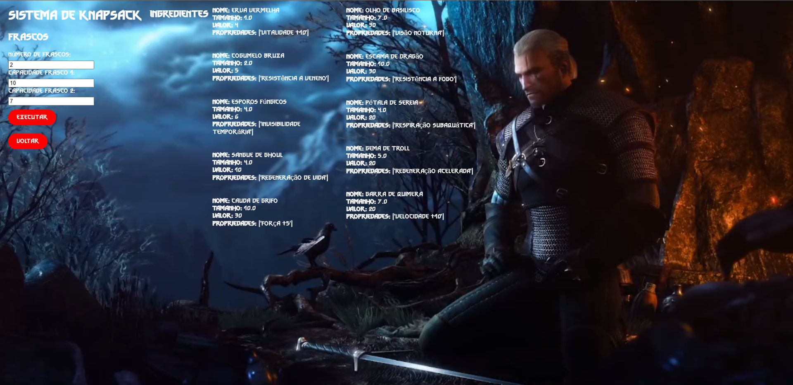

# Greed_WitcherAlchemy

**Número da Lista**:25<br>
**Conteúdo da Disciplina**: Greed algorithm<br>

## Alunos
|Matrícula | Aluno |
| -- | -- |
| 20/0028472  |  Vinícius Assumpção de Araújo T01 |
| 20/0028367  |  Victor Hugo Oliveira Leão T02 |

## Sobre

O projeto desenvolvido trata-se de uma aplicação Web inspirada no mundo da série de livros e jogos The Witcher. Há 2 vertentes nele:

1. O primeiro utiliza o algoritmo ambicioso Knapsack para uma manipulação de frascos e ingredientes de poções, em que o usuário informa quantos frascos (e suas capacidades) e, baseado no valor e tamanho dos ingredientes, o algoritmo apresenta como ficaria a distribuição dos ingredientes para cada um dos frascos. É um exercício muito interessante, pois para quem é fã, sabe que Geralt e os Witchers sempre têm esse recursos de poções consigo para poder ter melhores características durante seus contratos!
2. O segundo utiliza o algoritmo ambicioso Interval Scheduling para que Geralt possa saber a partir de seus vários contratos com horários de início, término e duração, como ele pode fazer o máximo de contratos possível.


## Screenshots





## Vídeo

- [youtube](https://www.youtube.com/watch?v=dORHhd0DiGA)

## Instalação 
**Linguagem**: Python<br>
**Framework**: <br>

Para rodar o projeto, é necessário ter a linguagem Python instalada e instalar as dependências por meio do comando: ```pip install -r requirements.txt```.

Assim, para executar o programa, rode o comando: ```python app.py``` na pasta WitcherAlc. Com isso, a aplicação Web está sendo executada na porta 5000 (acesse digitando ```localhost:5000``` no navegador).

O programa foi desenvolvido e testado no sistema operacional Linux (WSL).

## Uso 

O uso é bem simples, ao abrir no navegador o projeto, selecione entre ```Knapsack``` ou ```Contratos``` para ir ao módulo desejado (print 1).

Caso deseje ```Knapsack```, veja os ingredientes ao lado (tamanho e valor já estão preenchidos) e, assim, selecione a quantidade de frascos e preencha a quantidade de cada um. Ao enviar, o resultado do Knapsack será atualizado na tela.

Caso deseje ```Contratos```, selecione a quantidade de contratos (missões) e preencha o nome, descrição e tempo de início e término de cada um. Ao enviar, aparecerá o resultado Interval Scheduling, apresentando quais os contratos podem ser feitos a fim de maximizar a quantidade de contratos feitos.

## Outros 

Mostre o programa em execução para seus amigos e conhecidos que gostam de The Witcher, aposto que eles gostarão!

Algumas melhorias podem ser feitas, sinta-se a vontade para fazê-las e nos avisar:

- Usuário cadastrar os ingredientes e seus tamanhos e pesos.
- Melhorar a apresentação do Front-End.
- Verificações dos campos preenchidos pelo usuário.
